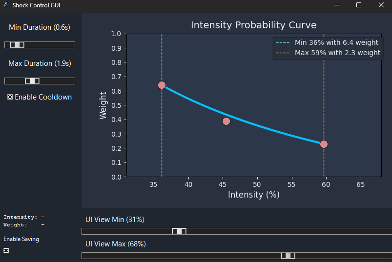

[![Contributors][contributors-shield]][contributors-url]
[![Forks][forks-shield]][forks-url]
[![Stargazers][stars-shield]][stars-url]
[![Issues][issues-shield]][issues-url]
[![project_license][license-shield]][license-url]

<!-- PROJECT LOGO -->
 

  

<h3 align="center">VRChat Shocker Link</h3>

  

    This simple python program connects a VRChat avatar parameter with your PiShock or OpenShock device
     
    It has chat message support, curve for intensity and a few more settings you can easily change in the UI
     
     
    <!-- <a href="https://github.com/github_username/repo_name">View Demo</a> 
    &middot; -->
    <a href="https://github.com/poprox24/VRChat-Shocker-Link/issues/new?labels=bug">Report Bug or Request Feature</a>
  

<!-- TABLE OF CONTENTS -->

  
Table of Contents

  <ol>
    <li>
      <a href="#getting-started">Getting Started</a>
      <ul>
        <li><a href="#prerequisites">Prerequisites</a></li>
        <li><a href="#installation">Installation</a></li>
      </ul>
    </li>
    <li><a href="#roadmap">Roadmap</a></li>
    <li><a href="#contributing">Contributing</a></li>
    <li><a href="#license">License</a></li>
    <li><a href="#contact">Contact</a></li>
  </ol>

<!-- GETTING STARTED -->
## Getting Started

How to setup this repository

### Prerequisites

Make sure to download this program before you continue:
* [Python](https://www.python.org/downloads/)

### Installation

1. Scroll up to the top of the page
2. Click on **Code** and then **Download ZIP**
    - Alternatively you can clone this repository using git
3. Extract the ZIP anywhere on your computer
4. Open **config.yml**
5. Change the **SHOCK_PARAMETER** to the parameter you created on your VRChat avatar and set **USE_PISHOCK** to true, if using a PiShock device
6. Run **RunShockerLink.bat**

(<a href="#readme-top">back to top</a>)

<!-- ROADMAP -->
## Roadmap

- [ ] Get shocker ID automatically from OpenShock devices
- [ ] Rework UI

See the [open issues](https://github.com/poprox24/VRChat-Shocker-Link/issues) for a full list of proposed features (and known issues).

(<a href="#readme-top">back to top</a>)

<!-- CONTRIBUTING -->
## Contributing

If you have a suggestion that would make this tool better, please fork the repo and create a pull request. You can also simply open an issue with the tag "enhancement".
Don't forget to give the project a star! Thanks again!

1. Fork the Project
2. Create your Feature Branch (`git checkout -b feature/AmazingFeature`)
3. Commit your Changes (`git commit -m 'Add some AmazingFeature'`)
4. Push to the Branch (`git push origin feature/AmazingFeature`)
5. Open a Pull Request

(<a href="#readme-top">back to top</a>)

### Top contributors:

<!-- LICENSE -->
## License

Distributed under the MIT License. See `LICENSE.txt` for more information.

(<a href="#readme-top">back to top</a>)

<!-- CONTACT -->
## Contact

Poprox24 - [@poprox422](https://twitter.com/poprox422) - poprox24.roxy@gmail.com

Project Link: [https://github.com/poprox24/VRChat-Shocker-Link](https://github.com/poprox24/VRChat-Shocker-Link)

(<a href="#readme-top">back to top</a>)

[contributors-shield]: https://img.shields.io/github/contributors/poprox24/VRChat-Shocker-Link.svg?style=for-the-badge
[contributors-url]: https://github.com/poprox24/VRChat-Shocker-Link/graphs/contributors
[forks-shield]: https://img.shields.io/github/forks/poprox24/VRChat-Shocker-Link.svg?style=for-the-badge
[forks-url]: https://github.com/poprox24/VRChat-Shocker-Link/network/members
[stars-shield]: https://img.shields.io/github/stars/poprox24/VRChat-Shocker-Link.svg?style=for-the-badge
[stars-url]: https://github.com/poprox24/VRChat-Shocker-Link/stargazers
[issues-shield]: https://img.shields.io/github/issues/poprox24/VRChat-Shocker-Link.svg?style=for-the-badge
[issues-url]: https://github.com/poprox24/VRChat-Shocker-Link/issues
[license-shield]: https://img.shields.io/github/license/poprox24/VRChat-Shocker-Link.svg?style=for-the-badge
[license-url]: https://github.com/poprox24/VRChat-Shocker-Link/blob/master/LICENSE
[product-screenshot]: images/screenshot.png

